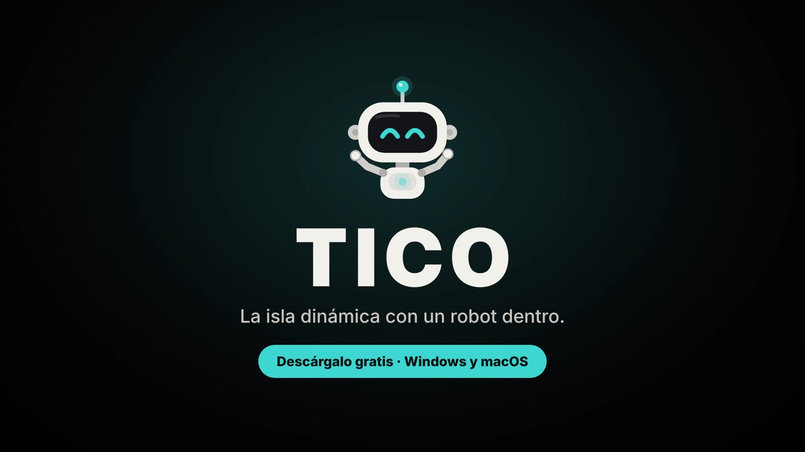

# Tico

Una **isla dinámica de escritorio** para Windows y macOS. Lleva el ratón al borde
superior de la pantalla y baja una cápsula negra con **Tico**, un pequeño robot que
chatea contigo y, solo cuando tú se lo pides, mira tu pantalla para ayudarte.

<p align="center"></p>

## Anuncio

<p align="center"><a href="promo/tico-anuncio.mp4"></a></p>

<p align="center"><a href="promo/tico-anuncio.mp4">▶ Ver el anuncio (35 s)</a> · <a href="promo/BRIEF.md">Brief y guion</a></p>

## Qué hace

- **La isla**: aparece al dejar el ratón en el borde superior (zona central), crece al
  pasar por encima y se abre al hacer clic. Fuera de la cápsula, los clics pasan a las
  apps de debajo. `Ctrl/⌘ + Mayús + Espacio` la abre para escribir y `Esc` la cierra.
- **En MacBook con notch**: la isla nace del propio notch. Le salen "orejas" a los lados y
  todo el contenido aparece por debajo, así que nunca queda tapado.
- **Tico**: robot propio con cuerpo y brazos, animado a 60 fps. Respira, parpadea (a veces
  dos veces), te sigue con la mirada, saluda al abrir la isla, gesticula al hablar, se
  rasca la cabeza, se lleva la mano a la barbilla al pensar, celebra con los brazos
  arriba y, si se aburre, mira alrededor o se estira. Tiene 8 expresiones: reposo,
  curioso, mirando, pensando, hablando, contento, error y dormido. Si le haces 3 clics
  seguidos, protesta.
- **Respuestas con formato**: listas, negritas y código, con botón para copiarlas.
- **Chat con IA**: Claude, OpenAI, Gemini u Ollama (local y gratis). Pones tu propia
  clave, que se guarda en el llavero del sistema. Las respuestas llegan en streaming.
- **Mira mi pantalla**: botón o `Ctrl/⌘ + Mayús + S`. Captura la pantalla o la ventana
  activa, te enseña la miniatura antes de enviarla y no captura nada si hay a la vista
  un gestor de contraseñas o la web de un banco. La imagen nunca se guarda en disco.
- **Personalizable**: colores de Tico, tamaño, posición, retardos, tema, idioma
  (castellano, català, English), atajos, apps bloqueadas, sonidos e inicio con el sistema.

Sin telemetría y sin cuentas.

## Descargar

Pulsa el botón de tu sistema y la descarga empieza sola:

<p align="center">
  <a href="https://github.com/salmeronvictor486-lang/ROBOT-ASISTENTE/releases/latest/download/Tico-Windows-x64-setup.exe"></a>
  <a href="https://github.com/salmeronvictor486-lang/ROBOT-ASISTENTE/releases/latest/download/Tico-Windows-x86-setup.exe"></a>
  <a href="https://github.com/salmeronvictor486-lang/ROBOT-ASISTENTE/releases/latest/download/Tico-macOS.dmg"></a>
</p>

<p align="center">
  <a href="https://github.com/salmeronvictor486-lang/ROBOT-ASISTENTE/releases/latest/download/Tico-Windows-x64-portable.zip"></a>
  <a href="https://github.com/salmeronvictor486-lang/ROBOT-ASISTENTE/releases/latest/download/Tico-Windows-x86-portable.zip"></a>
  <a href="https://github.com/salmeronvictor486-lang/ROBOT-ASISTENTE/archive/HEAD.zip"></a>
</p>

| Archivo | Para |
| ------- | ---- |
| [`Tico-Windows-x64-setup.exe`](https://github.com/salmeronvictor486-lang/ROBOT-ASISTENTE/releases/latest/download/Tico-Windows-x64-setup.exe) | Windows 10/11 de 64 bits con Intel o AMD (lo más común) |
| [`Tico-Windows-x86-setup.exe`](https://github.com/salmeronvictor486-lang/ROBOT-ASISTENTE/releases/latest/download/Tico-Windows-x86-setup.exe) | Windows de 32 bits y Windows 10 con procesador ARM |
| [`Tico-macOS.dmg`](https://github.com/salmeronvictor486-lang/ROBOT-ASISTENTE/releases/latest/download/Tico-macOS.dmg) | Mac con Intel o Apple Silicon |
| [`Tico-Windows-x64-portable.zip`](https://github.com/salmeronvictor486-lang/ROBOT-ASISTENTE/releases/latest/download/Tico-Windows-x64-portable.zip) | Igual que el `.exe` de 64 bits, pero sin instalar: descomprime y abre `Tico.exe` |
| [`Tico-Windows-x86-portable.zip`](https://github.com/salmeronvictor486-lang/ROBOT-ASISTENTE/releases/latest/download/Tico-Windows-x86-portable.zip) | Igual que el de 32 bits, sin instalar |
| [Código fuente (`.zip`)](https://github.com/salmeronvictor486-lang/ROBOT-ASISTENTE/archive/HEAD.zip) | Para compilarlo tú (ver más abajo) |

¿Cuál es el tuyo? En Windows: **Configuración → Sistema → Acerca de → Tipo de sistema**.
Si al abrir el de 64 bits sale "No se puede ejecutar esta aplicación en el equipo",
usa el de 32 bits.

- Los botones siempre bajan **la última versión publicada** (en
  [Releases](https://github.com/salmeronvictor486-lang/ROBOT-ASISTENTE/releases) están todas).
- La versión portable necesita **WebView2**: Windows 11 ya lo trae; en Windows 10, si no
  arranca, usa el instalador (lo instala solo) o descárgalo de Microsoft.
- Mientras el repositorio sea **privado**, los enlaces solo funcionan si has iniciado
  sesión en GitHub con una cuenta que tenga acceso. Si lo haces público, funcionarán
  para cualquiera.
- Para publicar una versión nueva: **Actions → Instaladores → Run workflow**.

Como la app **no está firmada** (firmar cuesta dinero), el sistema avisará la primera vez:

- **Windows**: SmartScreen dice "Windows protegió su PC". Pulsa **Más información →
  Ejecutar de todas formas**. Se instala solo para tu usuario (no pide administrador).
- **macOS** — sale "No se ha abierto Tico. Apple no ha podido verificar…". Es normal en
  apps sin firma de Apple; no es un virus. Para abrirla (solo la primera vez):
  1. Abre el `.dmg` y arrastra **Tico** a la carpeta **Aplicaciones** (no lo abras desde
     el `.dmg` ni desde el Escritorio).
  2. Abre Tico. Cuando salga el aviso, pulsa **Aceptar** (¡no "Trasladar a la Papelera"!).
  3. Ve a **Ajustes del Sistema → Privacidad y seguridad**, baja hasta **Seguridad** y
     pulsa **Abrir igualmente** junto a "Se ha bloqueado Tico". Pon tu contraseña.
  4. En el último aviso pulsa **Abrir**. A partir de ahí se abre normal.

  Alternativa con la Terminal (hace lo mismo de golpe):
  `xattr -dr com.apple.quarantine /Applications/Tico.app`
- **macOS, ver la pantalla**: la primera vez que uses "Mira mi pantalla", macOS pedirá
  permiso de **Grabación de pantalla**. Actívalo para Tico y vuelve a abrirlo.

### Quitar el aviso para siempre (firmar la app)

El aviso solo desaparece si la app está **firmada y notarizada por Apple** (y en
Windows, firmada con un certificado de código). No hay forma gratuita de hacerlo en
macOS: hace falta la cuenta de **Apple Developer (99 $/año)**. El workflow ya está
preparado; cuando tengas la cuenta:

1. En [developer.apple.com](https://developer.apple.com/account/resources/certificates)
   crea un certificado **Developer ID Application**, instálalo en tu Mac y expórtalo
   desde Acceso a Llaveros como `.p12` con contraseña.
2. Crea una contraseña de app en [account.apple.com](https://account.apple.com)
   (Inicio de sesión y seguridad → Contraseñas de apps).
3. En GitHub: **Settings → Secrets and variables → Actions → New repository secret**:

   | Secret | Valor |
   | ------ | ----- |
   | `APPLE_CERTIFICATE` | El `.p12` en base64: `base64 -i certificado.p12 \| pbcopy` |
   | `APPLE_CERTIFICATE_PASSWORD` | La contraseña del `.p12` |
   | `APPLE_SIGNING_IDENTITY` | `Developer ID Application: Tu Nombre (TEAMID)` |
   | `APPLE_ID` | El correo de tu cuenta de Apple |
   | `APPLE_PASSWORD` | La contraseña de app del paso 2 |
   | `APPLE_TEAM_ID` | Tu Team ID (10 caracteres) |

4. Lanza **Actions → Instaladores → Run workflow**. El `.dmg` saldrá firmado y
   notarizado, y macOS lo abrirá sin avisos.

Tico no sale en la barra de tareas ni en el Dock: vive en la **bandeja del sistema**
(Windows) o en la **barra de menús** (macOS). Desde ahí abres los ajustes o lo cierras.

## Requisitos para desarrollar (Windows 11)

1. **Rust** con [rustup](https://rustup.rs) (toolchain `stable-msvc`, la de por defecto).
2. **Node.js LTS** (22 o superior).
3. **Microsoft C++ Build Tools** con la carga de trabajo *Desarrollo para el escritorio con C++*.
4. **WebView2**: ya viene con Windows 11.

En macOS: `xcode-select --install`, Rust y Node. Guía oficial:
<https://v2.tauri.app/start/prerequisites/>

```powershell
git clone https://github.com/salmeronvictor486-lang/ROBOT-ASISTENTE.git
cd ROBOT-ASISTENTE
npm install
npx tauri info      # resumen del entorno: debe salir todo con ✔
npm run tauri dev   # la primera vez tarda varios minutos (compila Rust)
```

Para la IA gratis en local: instala [Ollama](https://ollama.com), descarga un modelo con
visión (`ollama pull gemma3`) y elige "Ollama" en Ajustes.

También puedes ver a Tico sin Rust: `npm run dev` y abre
<http://localhost:1420/playground.html> (página de pruebas de las expresiones).

## Comprobaciones

```powershell
npm run typecheck
npm run lint
npm test
cd src-tauri
cargo clippy --all-targets -- -D warnings
cargo test
```

GitHub Actions ejecuta lo mismo en Windows y macOS en cada push (workflow **CI**).

## Licencia

- Código: [MIT](LICENSE).
- Tico (personaje, nombre, diseño y sonidos): todos los derechos reservados, ver
  [ASSETS-LICENSE.md](ASSETS-LICENSE.md).

Inspirado en la idea de [coucou](https://github.com/Louis-CFM/coucou); no usa su código,
sus sonidos ni su mascota.
